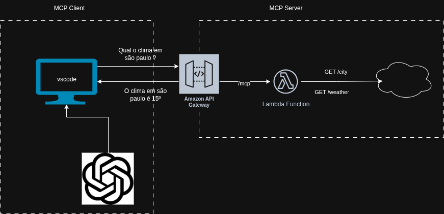

# mcp-serverless
MCP Server de clima usando arquitetura serverless da AWS.

### Arquitetura



### Deploy com terraform

```shell
cd infra
terraform apply -auto-approve
```

### Integração com vscode

Criar arquivo .vscode/mcp.json

```json
{
    "mcp": {
        "servers": {
            "weather-mcp-server": {
                "url": "{mcp_url}",
                "method": "POST",
                "headers": {
                    "Content-Type": "application/json"
                }
            }
        }
    }
}


```